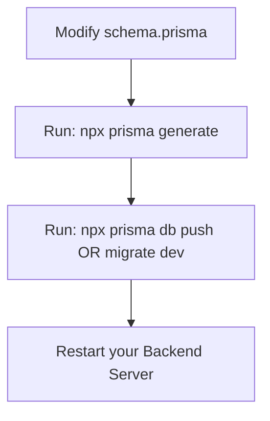

# Production-Grade Prisma Database Operations Guide

This guide details how to implement robust, production-level database queries and operations using **Prisma ORM** in your Node.js/Express backend. It focuses on the core database query methods (`findUnique`, `upsert`, transaction management, and transaction rollbacks) complete with type safety, error handling, and performance considerations.

---

## Table of Contents
1. [Prisma Queries: Getting Single Records (`findUnique`)](#1-prisma-queries-getting-single-records-findunique)
2. [Idempotent Operations: Create or Update (`upsert`)](#2-idempotent-operations-create-or-update-upsert)
3. [Transaction Management (`$transaction`)](#3-transaction-management-transaction)
4. [Error Handling in Production](#4-error-handling-in-production)
5. [Client Generation and Workflow](#5-client-generation-and-workflow)

---

## 1. Prisma Queries: Getting Single Records (`findUnique`)

The `findUnique` method is used to query a single record in the database using a **unique constraint** or **primary key**. In PostgreSQL, queries using indexes or primary keys run in $O(1)$ or $O(\log n)$ time, making them highly performant.

### Basic Syntax
```javascript
const user = await prisma.user.findUnique({
  where: {
    email: "user@example.com", // Must be marked @unique in schema.prisma
  },
});
```

### Production Best Practices:

#### 1. Partial Selection (`select`)
Avoid selecting all columns (especially sensitive ones like `password`). Use `select` to return only the fields your application needs, reducing network latency and memory overhead.

```javascript
const doctor = await prisma.clinic.findUnique({
  where: { id: clinicId },
  select: {
    id: true,
    owner_doctor_name: true,
    speciality: true,
  },
});
```

#### 2. Eager Loading Relations (`include`)
Load related records in a single database round-trip. Prisma executes a sub-query under the hood and joins the results.

```javascript
const clinicWithAppointments = await prisma.clinic.findUnique({
  where: { id: clinicId },
  include: {
    appointments: {
      where: { status: "CONFIRMED" },
      orderBy: { appointmentDate: "asc" },
    },
  },
});
```

> [!WARNING]
> You cannot combine `select` and `include` at the top level of a query. If you want to select specific fields and also fetch relations, nest the select inside the relation key:
> ```javascript
> prisma.clinic.findUnique({
>   where: { id: clinicId },
>   select: {
>     clinic_name: true,
>     appointments: { // Nesting select inside the relation
>       select: { appointmentDate: true }
>     }
>   }
> })
> ```

---

## 2. Idempotent Operations: Create or Update (`upsert`)

An `upsert` operation attempts to update a record if it already exists, or creates it if it does not. This is critical for idempotency (e.g., email OTP verification requests or configuration settings) to prevent duplicate key errors.

### Basic Syntax
```javascript
const record = await prisma.emailVerification.upsert({
  where: {
    gmail: "doctor@example.com", // Unique identifier to check existence
  },
  update: {
    otp_hash: "hashed_code_here",
    otp_attempts: 0,
    otp_expires_at: new Date(Date.now() + 5 * 60 * 1000),
  },
  create: {
    gmail: "doctor@example.com",
    otp_hash: "hashed_code_here",
    otp_expires_at: new Date(Date.now() + 5 * 60 * 1000),
    otp_attempts: 0,
  },
});
```

### Key Considerations for Production:
* **Atomic execution:** The database handles the check-and-write operation atomically, eliminating race conditions where two simultaneous API calls could result in duplicate records.
* **Separation of Concerns:** Ensure the `update` block only contains fields you want changed, and the `create` block contains all required fields for database constraint compliance.

---

## 3. Transaction Management (`$transaction`)

When modifying multiple tables, database transactions ensure **Atomicity, Consistency, Isolation, and Durability (ACID)**. If any operation within the transaction fails, all changes are rolled back automatically.

### Pattern A: Sequential Transactions (Array-based)
Useful when operations don't depend on the output of previous queries. Prisma executes these concurrently in a single transaction block.

```javascript
const [deactivatedClinic, cancelledAppointments] = await prisma.$transaction([
  prisma.clinic.update({
    where: { id: clinicId },
    data: { current_active_status: "closed" },
  }),
  prisma.appointment.updateMany({
    where: { clinicId, status: "PENDING" },
    data: { status: "CANCELLED" },
  }),
]);
```

### Pattern B: Interactive Transactions (Callback-based)
Used when subsequent operations depend on the result of preceding queries (e.g., verifying a session exists before creating a clinic). Pass `tx` instead of `prisma` to perform operations within the transaction scope.

```javascript
const registeredClinic = await prisma.$transaction(async (tx) => {
  // 1. Fetch pending verification inside the transaction
  const pending = await tx.emailVerification.findUnique({
    where: { gmail: clinicData.gmail },
  });

  if (!pending || !pending.verified) {
    throw new Error("Email verification is required before clinic registration.");
  }

  // 2. Create the Clinic record
  const clinic = await tx.clinic.create({
    data: {
      owner_doctor_name: clinicData.owner_doctor_name,
      gmail: clinicData.gmail,
      password: clinicData.password,
      phone: clinicData.phone,
      speciality: clinicData.specialty,
      medical_council_reg_no: clinicData.medicalNo,
      experience: clinicData.experience,
      qualification: clinicData.qualifications,
      clinic_name: clinicData.clinicName,
      address: clinicData.address,
      city: clinicData.city,
      consultations_fee: clinicData.fee,
    },
  });

  // 3. Delete the temporary verification record to clean up
  await tx.emailVerification.delete({
    where: { gmail: clinicData.gmail },
  });

  // Return the newly created clinic
  return clinic;
});
```

> [!IMPORTANT]
> Always prefix transaction queries with `tx` instead of the global `prisma` client. If you call `prisma` inside the callback, it will run outside the transaction scope and bypass the rollback mechanism.

---

## 4. Error Handling in Production

Production applications must handle Prisma errors gracefully to prevent exposing database internals (like table names, columns, or connection strings) to API clients.

### Custom Database Middleware Error Handler
Use Prisma Client's error codes to map database failures to user-friendly HTTP responses:

```javascript
import { Prisma } from "@prisma/client";

export const handleDbError = (err, res) => {
  if (err instanceof Prisma.PrismaClientKnownRequestError) {
    switch (err.code) {
      case "P2002":
        // Unique constraint violation (e.g. duplicate email/phone)
        const fields = err.meta?.target || ["field"];
        return res.status(409).json({
          success: false,
          error: `A record with this ${fields.join(", ")} already exists.`,
        });

      case "P2025":
        // Record not found
        return res.status(404).json({
          success: false,
          error: "The requested record could not be found.",
        });

      default:
        return res.status(400).json({
          success: false,
          error: `Database error occurred (Code: ${err.code})`,
        });
    }
  }

  // Fallback for general errors
  console.error("Unhandled Database Error:", err);
  return res.status(500).json({
    success: false,
    error: "An unexpected database error occurred.",
  });
};
```

### Common Prisma Error Codes Reference Table:

| Error Code | Meaning | Typical HTTP Status |
|---|---|---|
| **P2002** | Unique constraint failed (e.g., duplicated unique email) | `409 Conflict` |
| **P2003** | Foreign key constraint failed (e.g., linking to invalid ID) | `400 Bad Request` |
| **P2025** | Record to update or delete does not exist | `404 Not Found` |
| **P2021** | The table does not exist in the current database | `500 Internal Error` |

---

## 5. Client Generation and Workflow

Whenever you change your [schema.prisma](file:///C:/react%20js%20Udemy%20course/medical-website-sinchan/Backend/prisma/schema.prisma) file, you must run the following steps in sequence:



### Command Reference:

* **Generate Client Types:**
  ```bash
  npx prisma generate
  ```
  Rebuilds the `@prisma/client` engine types in your project. Run this after *every* change to the schema.

* **Apply Changes Locally (Quick Prototype):**
  ```bash
  npx prisma db push
  ```
  Syncs your schema directly with your PostgreSQL database without generating formal migration records. Useful for fast, iterative local development.

* **Apply Changes (Production / Dev Migrations):**
  ```bash
  npx prisma migrate dev --name name_of_migration
  ```
  Generates a migration SQL file under `prisma/migrations/` and updates the database. Run this for tracked changes before pushing to your repository.
